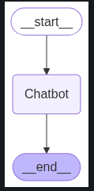
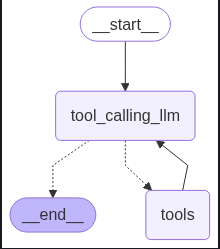
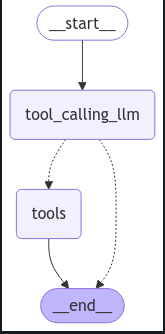
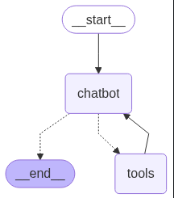
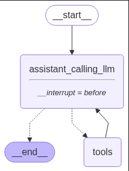
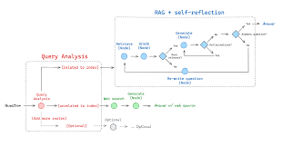
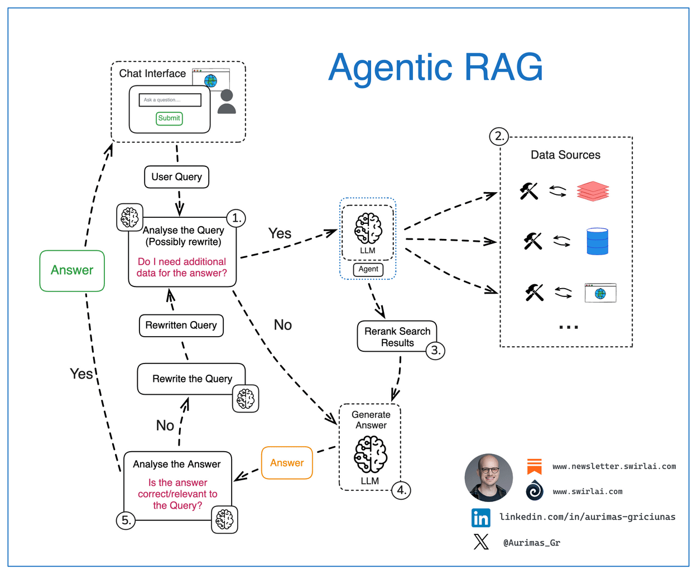
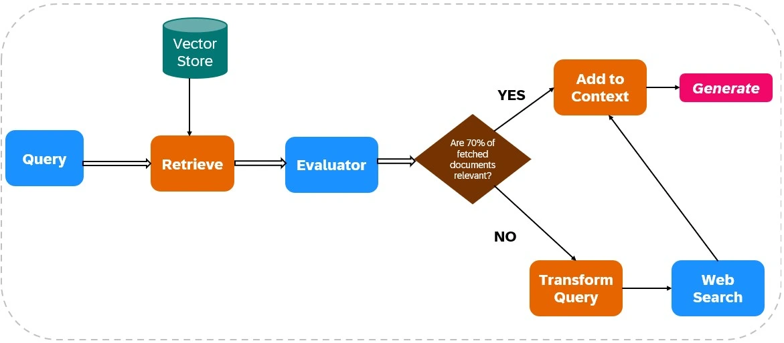
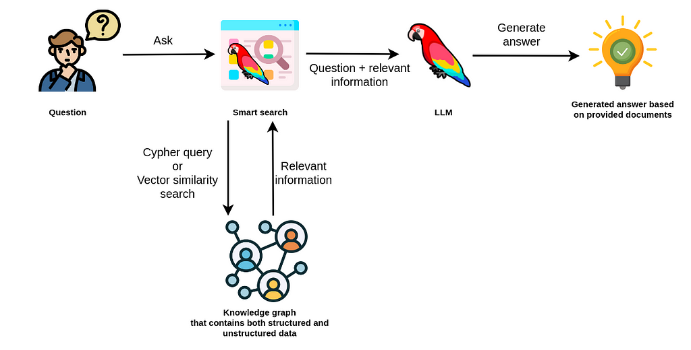
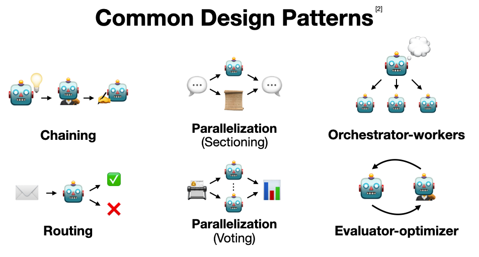

# Agentic AI , RAGENTS(RAG + AI Agents) and more ...

A documented repository for AGENTS, robust workflows, human feedback, hands-on projects, and a sleek UI using Streamlit.

---

## Repository Overview

This repository encapsulates:

- **RAGENTS** — RAG fused with intelligent agents
- **Workflows** — Generator–Evaluator, Orchestrator–Worker, Prompt Chaining, Parallelization, Routing
- **HIL** — Human in the Loop for feedback and correction

---

## RAGENTS:

Introducing **RAGENTS** — which elegantly blend **Retrieval-Augmented Generation (RAG)** with **intelligent agents** to craft hybrid, adaptable, and autonomous systems.

### RAGENTS Flavors

- **Adaptive RAGENTS**  
  Agents that dynamically refine retrieval and generation strategies based on context and feedback.

- **Agentic RAGENTS**  
  Agents that reason about their actions—determining when to search, synthesize, or delegate.

- **Corrective RAGENTS (CRAGENTS)**  
  Integrate evaluators that detect reasoning or retrieval errors and correct them through iterative loops.

---

## Agentic Workflows

Well-designed workflows are the backbone of effective agentic systems:

| Workflow Pattern        | Description                                                            |
| ----------------------- | ---------------------------------------------------------------------- |
| **Generator–Evaluator** | Generator proposes, evaluator refines—ensuring quality responses       |
| **Orchestrator–Worker** | A central orchestrator delegates tasks to specialized agents           |
| **Prompt Chaining**     | Breaks reasoning into step-wise prompts, creating a thought chain      |
| **Parallelization**     | Executes multiple agents or retrieval calls simultaneously             |
| **Routing**             | Dynamically selects tools or sub-agents based on input characteristics |

---

## Human in the Loop (HIL)

Even the best agents need human oversight:

- Enable **human feedback** on outputs
- Provide **override/correction mechanisms**
- Support **active learning loops**, where models improve from human-guided intervention

---

## 📐 All Project Architectures and Workflows

   
  <em>Single Agent</em>

   
  <em>Single Agent + Tools</em>

   
  <em>Tools + LLMs other variant</em>

   
  <em>Tools + LLMs</em>

   
  <em>HIL</em>

---

## 🌐 RAGENTS Variants

   
  <em>Adaptive RAGENT</em>

   
  <em>Agentic RAG Workflow</em>

   
  <em>Corrective RAGENT (CRAG)</em>

   
  <em>Knowledge-Augmented Graph (KAG)</em>

## 🤖 LLM Workflows / Design Patterns

   
  <em>All LLM Workflows Overview</em>

